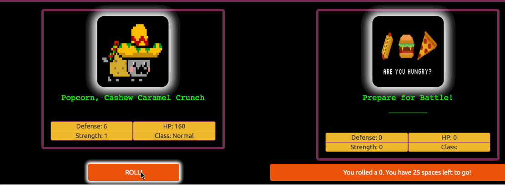

# 

# <center> A Game of Wits & Grits
### <center> [https://food-fight-ssm.herokuapp.com](https://food-fight-ssm.herokuapp.com)
# 


Battle your way to victory with characters created from UPC nutrition data!
Encounter food-based villains, collect special food items that bump up your health and stats, and face off with the evil final boss, Kevin Bacon & Eggs.


- [How to Get Started](#how-to-get-started)
- [Application Deployment and Dependencies](#application-deployment-&-dependencies)
- [Nutritionix API](#nutritionix-api)
- [Why We Made Such A Ridiculous Game](#why-we-made-such-a-ridiculous-game)
- [Admin Layer](#admin-layer)
- [Future Features](#future-features)
- [Contributing](#contributing)
- [Creators](#creators)


### How to Get Started

1. Clone this repo.
2. Run `npm install` in your terminal. This will install the dependencies needed for this application.
3. Run `bundle` in the terminal to install the necessary ruby gems.
4. Run the grunt command from the root directory of the project. This will execute the automated build process.
5. Start the rails server by typing `rails s` into your terminal.
6. Go to http://localhost:3000/ to view your application locally.


### Application Deployment & Dependencies

This application features continuous integration that automatically deploys to the live site any time a commit or merge to the `master` branch is made. Heroku will run the automated `grunt` build prior to deploying the updated code. If the build command fails, the live site will not be updated.

Due to this automated deployment system, all dependencies must be installed as regular application dependencies and NOT as devDependencies. When adding additional dependencies, use `--save` and not `--save-dev`.


The testing suite is run through Karma. Heroku does not currently support running Karma through its automatic deployment feature. Run the `grunt karma` command prior to committing or merging to the `master` branch to ensure that the code has been tested properly.

Back-end testing is performed via Rspec. In order to run the tests, simply type `rspec` into the command-line. By default, the Simplecov gem is installed to analyze test coverage. Code coverage will be logged in a separate log file, a link to which will be displayed each time rspec is run.

### Nutritionix API
[](https://www.nutritionix.com/)

UPC data is sent to the Nutritionix API in order to create character cards. In order to use the application you will need to get your own Nutritionix API key, which is available for free if you require less than 50 UPC searches per day.

The application is configured to install `dotenv-rails` with bundler for storing  secrets. Set your Nutritionix APP ID equal to NUTRITIONIX_APP_ID and your APP KEY equal to NUTRITIONIX_APP_KEY in the .env file located in your project root directory.

 ```
 NUTRITIONIX_APP_ID=(yourAppIdHere)
 NUTRITIONIX_APP_KEY=(yourAppKeyHere)
 ```

### Admin Layer
The application comes equipped with an administrative layer for keeping track of player cards and basic user information. You must set up your first administrator via rails console. To get started with as an admin:

1. Enter your terminal and run `rails c`.
2. Query the database for the user you would like to make an administrator.
3. Update the "role" to be "admin".

Once the user has been updated, head to /sessions/new to log in. Once logged in you will have access to the ability to manually make cards and card assignments, as well as track users. To make future users administrators, simply select "change role" on the users index and enter "admin".


### Why We Made Such A Ridiculous Game

Studies have shown that billions of people on this planet eat food. We've been eating food our entire lives. When we were tasked with coming up with an idea for a final project at The Iron Yard DC, we decided to take our love of food and our love of video games and combine them into this game.

The inspiration for using UPC data was a vintage Japanese handheld video game called [Barcode Battler]. (https://en.wikipedia.org/wiki/Barcode_Battler) This console allowed the player to scan barcodes from any product to create characters, enemies and power-ups.

#### Future Features
1. Character cards created by users have an expiration date. Upon reaching this date, the food will "go bad" and be converted into an enemy card, against which the user's "fresh" cards will battle.
2. The ability to choose which saved card the user would like to use to play the game directly from the "view all cards" page. Currently only the most recently created card is used for battle.
3. A new card will drop in on every roll for all enemies, items, and neutral spaces.
4. The ability to display multiple player cards and drag and drop them into battle as needed, or determine the battle outcome of the group of cards vs the enemy or enemies.
5. More defensive and offensive buffs from available nutrition data such as percentages of daily vitamins.
6. Character leveling and enemy stats scaling based on the character level.


#### Known Issues
1. Selecting a card in the "View All Cards" tab only selects the card with the
latest UPC scan-not the actual card selected.
2. Bill Murray populates the card image in the "View All Cards" rather than the actual food item. We asked nicely that he leave but he seems to like being there.
3. Occasionally index 0 of the enemy array will be selected for a random battle. This index is reserved for boss data and if boss data has not been loaded in, then this will show a card titled 'reserved for boss'.
4. The 'defend' button works but will not be useful until the option to fight with more than one character is implemented.
5. The application crashes if the UPC search limit from Nutritionix is exceeded. Attempts to upload more UPCs will result in an object error and no data will be returned.


### Contributing

Like our game? Think it could be better? Share your ideas!
1. Think up an awesome idea.
2. [Fork this repo.] (https://github.com/H34TH3RS/food_fight#fork-destination-box)
3. Create a branch for your feature. `git checkout -b feature-name`
4. Add and commit your changes. `git add file_name` `git commit -m "I added a thing!"`
5. Push your feature to your branch. `git push origin feature-name`
6. Create a Pull Request.
7. Profit!


### Creators
[](https://github.com/WatchTheGap) | [](http://www.sethgabrielbrady.com) | [](https://github.com/mstoople532)
---|---|---
[<center>Sara Basile](https://github.com/WatchTheGap) | [<center>Seth Brady](https://github.com/sethgabrielbrady) | [<center>Molly Stoopler](https://github.com/mstoople532)
